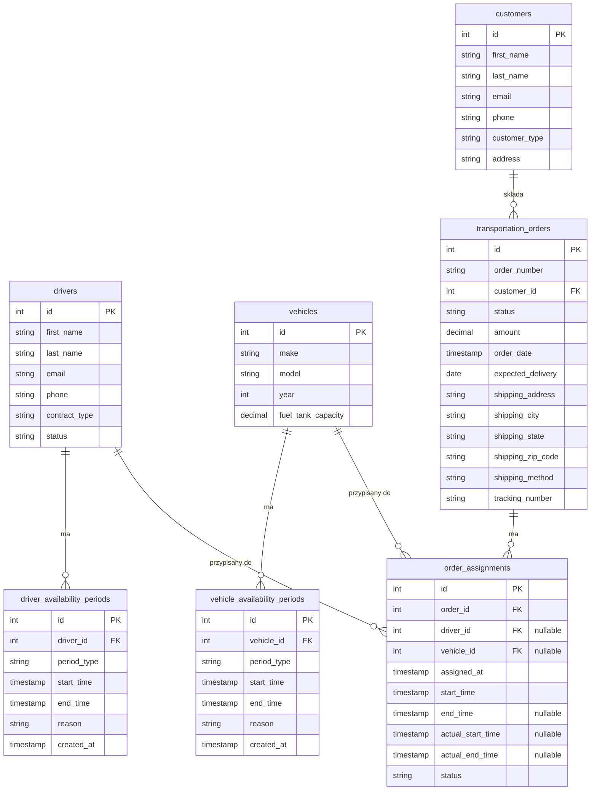
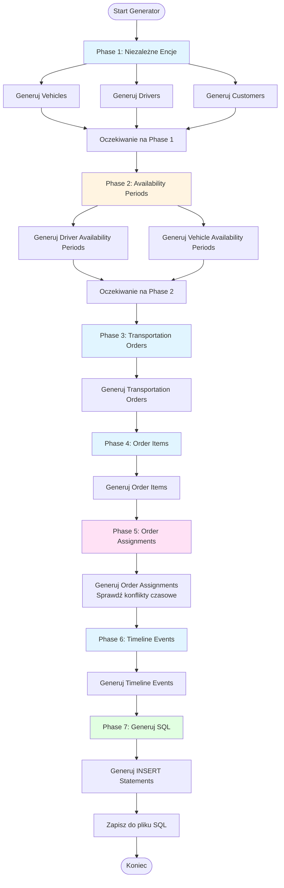
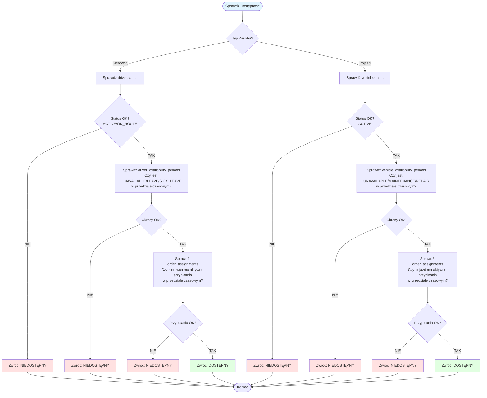
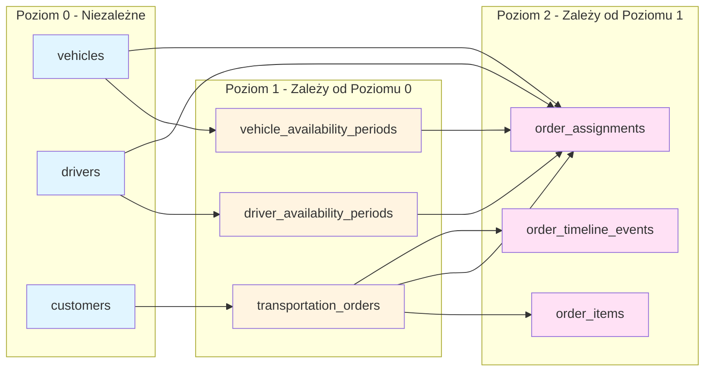
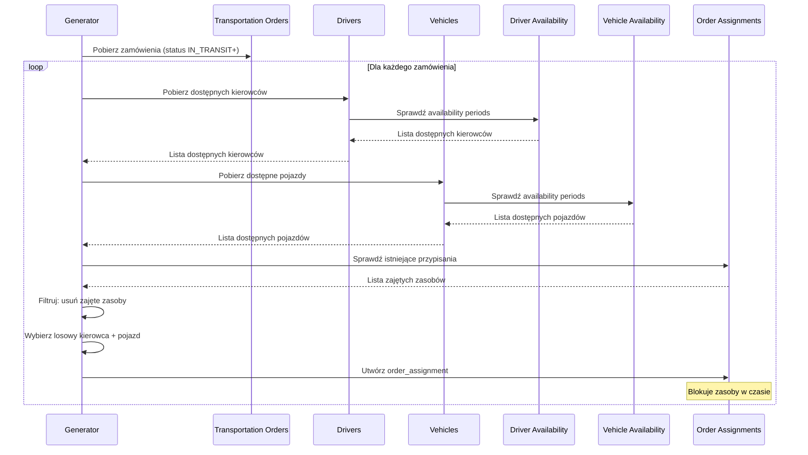
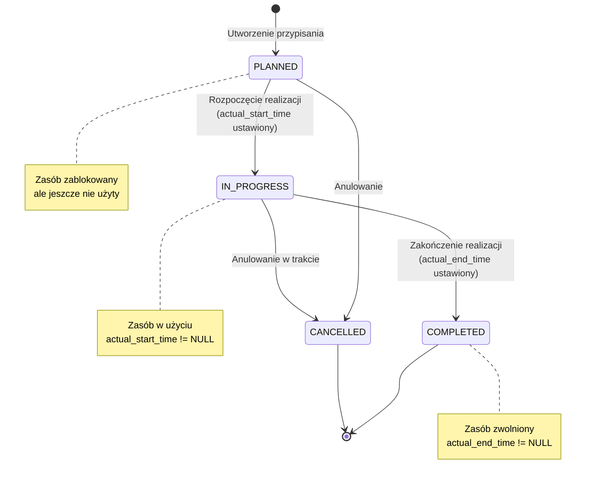
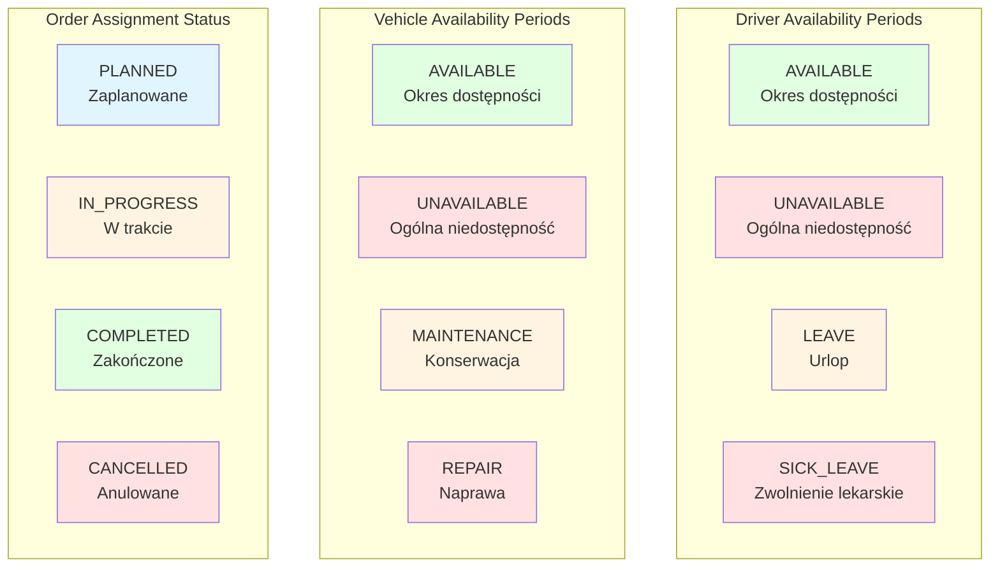
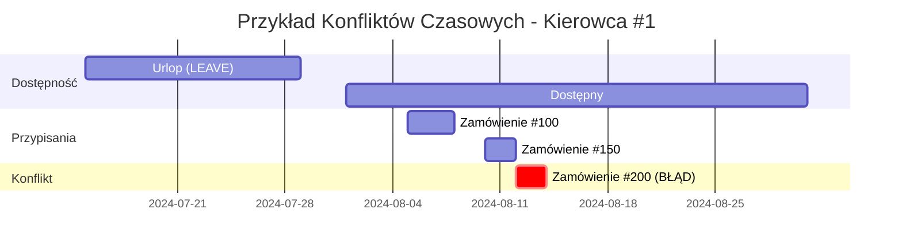

# Diagramy Systemu Dostępności

## 1. Diagram Relacji Encji (ERD)

## 2. Diagram Przepływu Generowania Danych

## 3. Diagram Sprawdzania Dostępności (Algorytm)

## 4. Diagram Zależności Generowania (Dependency Graph)

## 5. Diagram Przypisywania Zasobów do Zamówień

## 6. Diagram Stanów Przypisania (State Machine)

## 7. Diagram Typów Okresów Dostępności

## 8. Diagram Konfliktów Czasowych

**Legenda:**
- Zielony: Okres dostępności
- Niebieski: Zaplanowane przypisania
- Czerwony: Konflikt (próba przypisania w czasie, gdy zasób jest zajęty)

---

## Uwagi do Diagramów

1. **Diagram ERD** pokazuje wszystkie relacje między encjami, w tym nullable foreign keys w `order_assignments`.

2. **Diagram Przepływu Generowania** pokazuje fazy generowania danych z uwzględnieniem zależności.

3. **Diagram Sprawdzania Dostępności** ilustruje algorytm weryfikacji dostępności zasobu w trzech krokach:
   - Status bazowy
   - Okresy niedostępności
   - Aktywne przypisania

4. **Diagram Zależności** pokazuje, które encje mogą być generowane równolegle, a które wymagają sekwencyjnego przetwarzania.

5. **Diagram Sekwencji** pokazuje proces przypisywania zasobów do zamówień z uwzględnieniem sprawdzania dostępności.

6. **Diagram Stanów** pokazuje możliwe przejścia między statusami przypisania.

7. **Diagram Typów** wizualizuje wszystkie możliwe wartości enumów.

8. **Diagram Gantt** pokazuje przykład konfliktu czasowego - próba przypisania kierowcy do zamówienia w czasie, gdy jest już przypisany do innego.

